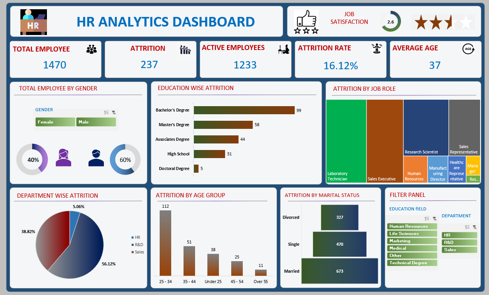

# HR Analytics Dashboard

## 📌 Project Overview
This project is an HR Analytics Dashboard created to analyze employee attrition, workforce demographics, job satisfaction, and department-wise employee trends.

The dashboard helps HR teams and management understand the major factors affecting employee retention and organizational performance.

The dataset used for this project was taken from Kaggle and visualized using Power BI.

---

## 📊 Dashboard Preview

---

## 🚀 Features

- Total Employee Analysis
- Attrition & Attrition Rate Tracking
- Active Employees Overview
- Job Satisfaction Rating
- Gender Distribution Analysis
- Education-wise Attrition
- Department-wise Attrition
- Attrition by Job Role
- Attrition by Marital Status
- Attrition by Age Group
- Interactive Filter Panel

---

## 📈 Key Insights

- Total Employees: 1470
- Total Attrition: 237
- Attrition Rate: 16.12%
- Active Employees: 1233
- Average Employee Age: 37

### Observations
- Employees with Bachelor’s Degree show the highest attrition.
- The 25–34 age group has the maximum employee attrition.
- Sales and R&D departments contribute the highest attrition rates.
- Male employees account for a higher percentage compared to female employees.

---

## 🛠️ Tools & Technologies Used

- Power BI
- Microsoft Excel / CSV
- Kaggle Dataset
- Data Cleaning & Visualization Techniques

---

## 📂 Dataset

Dataset Source: Kaggle HR Analytics Dataset

---

## 📌 KPIs Used

- Total Employees
- Attrition Count
- Attrition Rate
- Active Employees
- Average Age
- Job Satisfaction Score

---

## 🎯 Objective

The main objective of this dashboard is to:
- Analyze employee attrition trends
- Improve workforce decision-making
- Identify departments with high attrition
- Understand demographic-based employee patterns

---

## 📷 Dashboard Components

| Section | Description |
|----------|-------------|
| KPI Cards | Shows major HR metrics |
| Pie Charts | Department and gender analysis |
| Bar Charts | Education and age-wise attrition |
| Treemap | Job role attrition analysis |
| Filters | Dynamic dashboard interaction |

---

## 🔮 Future Improvements

- Add predictive attrition analysis using Machine Learning
- Include salary and performance analysis
- Add real-time database connectivity
- Improve mobile responsiveness

---

## ⭐ If you like this project

Give this repository a ⭐ on GitHub and support the project.
